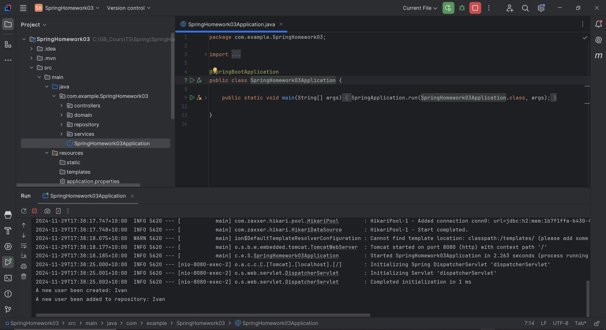
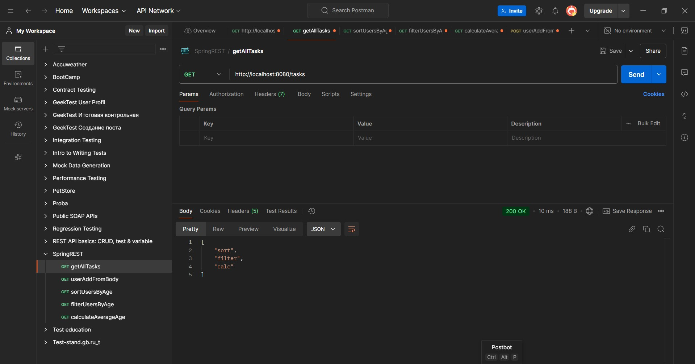
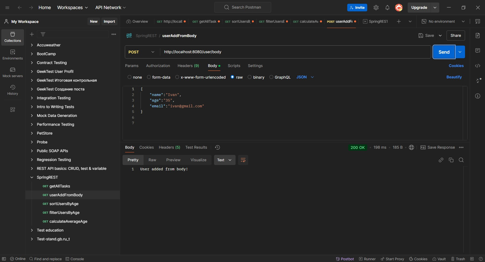
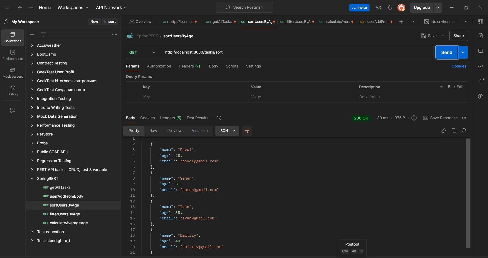
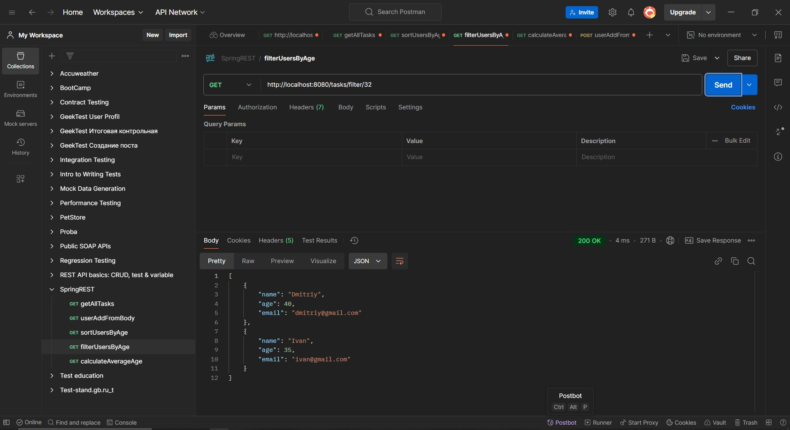
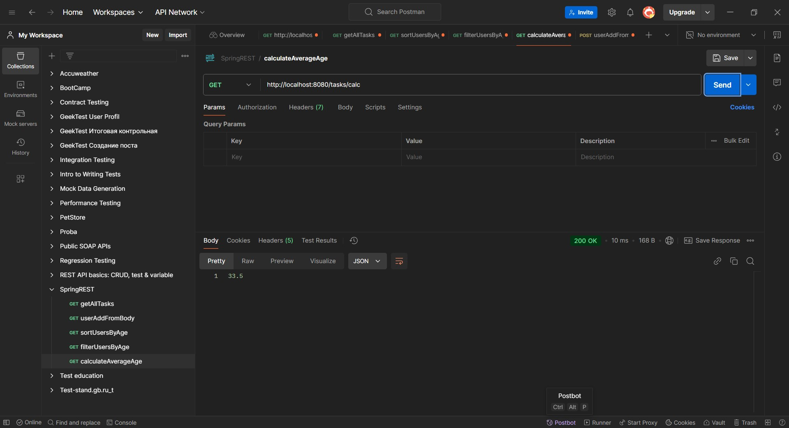

# Урок 3. 
Использование Spring для разработки серверного приложения

## Задание: 
Используя Spring, создайте серверное приложение, которое обрабатывает HTTP-запросы и возвращает JSON-ответы.

===============================================

# Демонстрация решения:

## Нотификация:

## Получение списка задач:

## Создание нового `user` через `body`:

## Получение списка `user` с сортировкой по возрасту:

## Получение списка `user` с фильтром по возрасту:

## Получение среднего арифметического `user` по возрасту:
